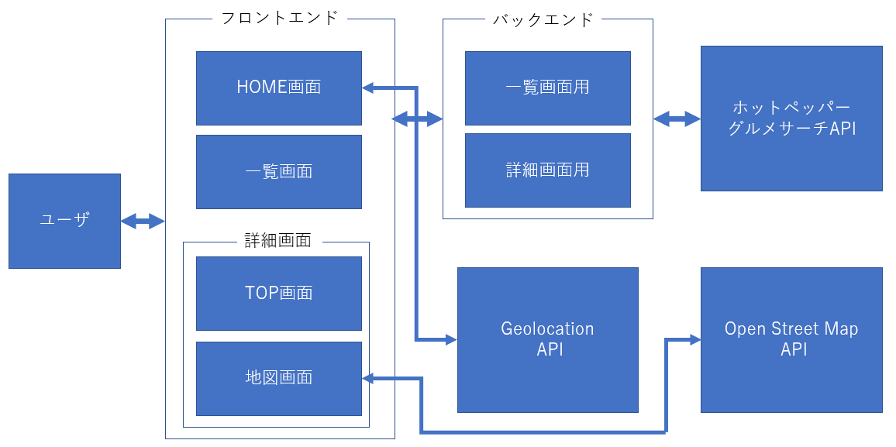

# 簡易仕様書

## アプリ名
Onaka-su-eater

## 対象OSおよびブラウザ(ver.含む)
### 対象ブラウザ
- Chrome 107.0.5304.107

### 対象OS
- windows11（docker-composeファイルを提供しているため，大体の環境でも動くと思われます）

## 開発期間・言語
### 開発期間
- 2週間

### 言語 (.ver含む)
- Python 3.10.8
- JavaScript (nodejs 16.18.1)

## 機能概要
- 店舗検索：ホットペッパーグルメサーチAPIを使用して，現在地付近の飲食店を取得する
    - キーワード検索機能：指定された距離内でキーワードを含むレストランも取得可能
- 店舗一覧ソート：店舗一覧を取得する際に，おすすめ順と近い順のソートが可能
- 店舗詳細情報取得：ホットペッパーグルメサーチAPIを使用して，指定した飲食店の詳細情報を取得する
    - 地図表示：OpenStreetMapAPIを使用して，指定した店舗にピンを立てた地図を表示する

## フレームワーク (ver.含む)
- vue 3.2.44
- fastapi 0.87.0

## 設計ドキュメント
- 今回はバックエンドを外部API取得のための中継地点として使用しているため，DBは使用していない
- 簡単な全体像を示す
- サーバを立ち上げた状態で「localhost:8080/docs」にアクセスすることでswaggerUIを確認可能




## こだわったポイント
- キーワードを入力して検索できるようにした
- 検索結果のヘッダーのみにソート機能を追加した
- 詳細画面に地図を表示できるページを別途作成した
- docker環境を提供した

## デザイン面でこだわったポイント
- 飲食店舗検索アプリということで，ヘッダーやフッター，検索ボタンなどを暖色でまとめた
- ヘッダー・フッターと他のボディ部分との色合いの急激な変化を抑えるためにグラデーションを用いて印象を少し自然にした
- 全体的に扱いやすいように中心に配置するように心がけた
- ソート機能といった主たる機能でないものは，ヘッダー部分に置いた
- ボタンやセレクトタグも若干リッチな見た目に変更し，デフォルトより大きくした

## アドバイスしてほしいポイント
### デザイン面
- 暖色にしたものの，ヘッダ・フッターが背景から少し浮いているように感じられる．より適切な配色があれば知りたい
- 検索結果表示ページのみのヘッダー部分にソートのためのタグを置いているが，より適切な位置があれば知りたい

### 技術面
- geolocationAPIで現在地取得を行ったのちにページ遷移する処理を成功時のコールバック関数内に書いているが，より理にかなった処理があれば知りたい
- バックエンドからデータ取得後に，レンダリングする処理をv-ifで待機させているが，より理にかなった書き方があれば知りたい
- ページ計算のために全てのデータ（最大100店舗）を取得してから，同一ページ内で表示する情報を変化させているが，さらに効率的な方法があれば知りたい
- 一部のページのヘッダーのみに値を渡す場合，router-viewから渡すと微妙になってしまったため，このような場合の適切な対応方法
- どこまでコンポーネント化すべきか

## 自己評価
- 点数：70 / 100
- コードにまだ無駄な箇所が多い（機能を最低限実現できればいいみたいな書き方が多い）


## 手順
- 最後に起動までの手順を簡単に記載しておく
1. git clone https://github.com/amac-53/Onaka-su-eater
2. backend直下に.envファイルを作成し，以下を記載
    ```HOTPEPPER_API_KEY='APIキー'```
3. docker-compose up -d でイメージ＋コンテナを作成し，起動
4. localhost:5173にアクセス